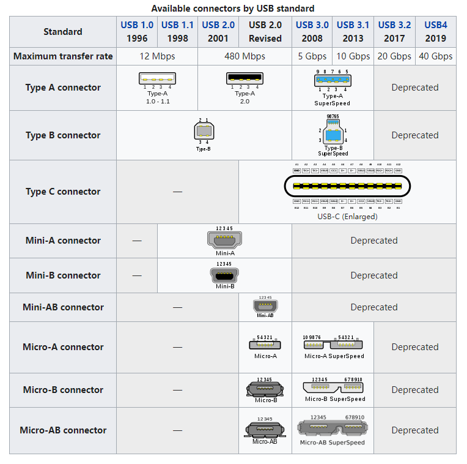

# usbutils-010 学习笔记

**Universal Serial Bus (USB)**


```
Something I hope you know before go into the coding~
First, please watch or star this repo, I'll be more happy if you follow me.
Bug report, questions and discussion are welcome, you can post an issue or pull a request.
```

## 软件信息

```
[root@rocky-clion /data/usbutils-010.git]# yum info usbutils
Last metadata expiration check: 4:07:14 ago on Fri 01 Jul 2022 10:09:49 AM CST.
Installed Packages
Name         : usbutils
Version      : 010
Release      : 3.el8
Architecture : x86_64
Size         : 359 k
Source       : usbutils-010-3.el8.src.rpm
Repository   : @System
From repo    : anaconda
Summary      : Linux USB utilities
URL          : http://www.linux-usb.org/
License      : GPLv2+
Description  : This package contains utilities for inspecting devices connected to a
             : USB bus.

[root@rocky-clion /data/usbutils-010.git]# rpm -ql usbutils
/usr/bin/lsusb
/usr/bin/lsusb.py
/usr/bin/usb-devices
/usr/bin/usbhid-dump
/usr/share/doc/usbutils
/usr/share/doc/usbutils/NEWS
/usr/share/licenses/usbutils
/usr/share/licenses/usbutils/GPL-2.0.txt
/usr/share/licenses/usbutils/GPL-3.0.txt
/usr/share/man/man1/usb-devices.1.gz
/usr/share/man/man8/lsusb.8.gz
/usr/share/man/man8/usbhid-dump.8.gz
```


## 目录

* [USB历史](docs/USB历史.md)


## 总结


## 图示




---
