# USB历史


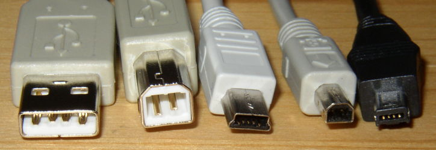

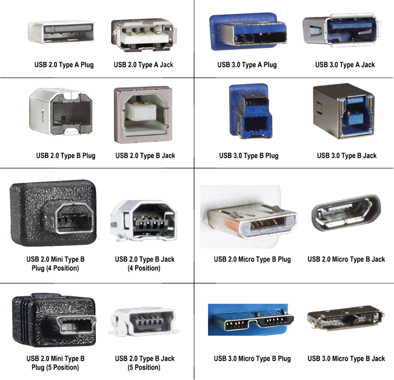

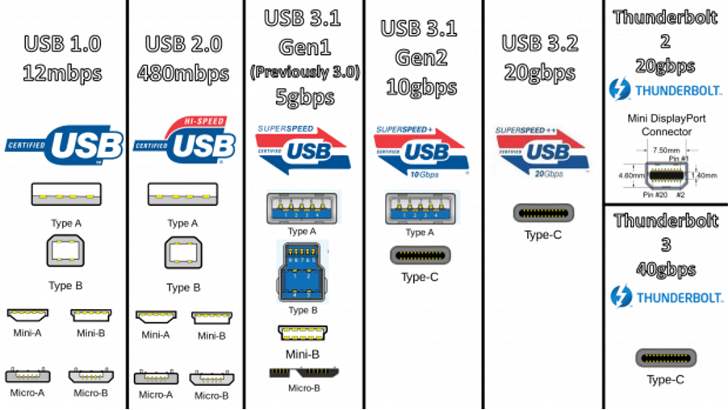

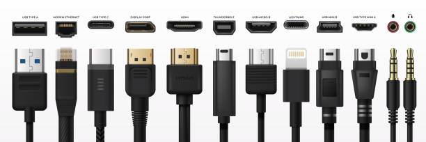


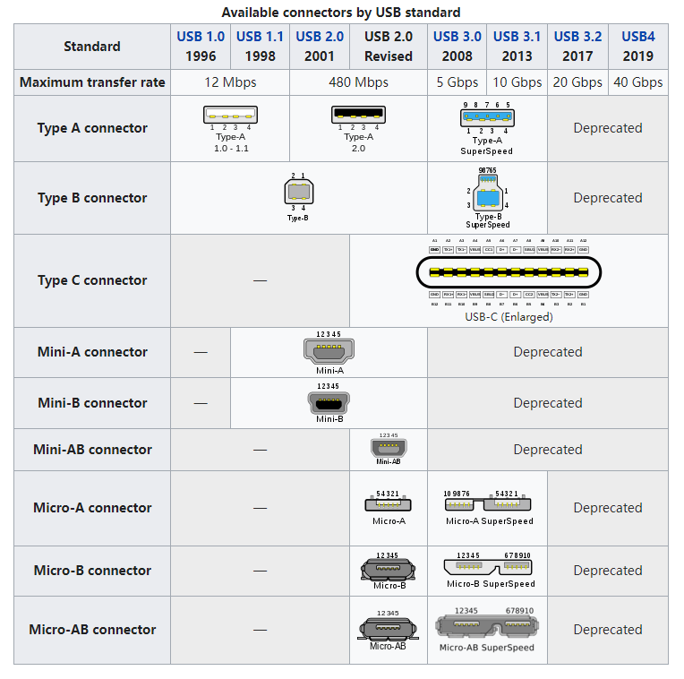

## 诞生

* USB最初是由英特尔与微软倡导发起，最大的特点是尽可能地实现热插拔和即插即用。
* 当设备插入时，主机枚举到此设备并加载所需的驱动程序，因此其在使用上远比PCI和ISA等总线方便。

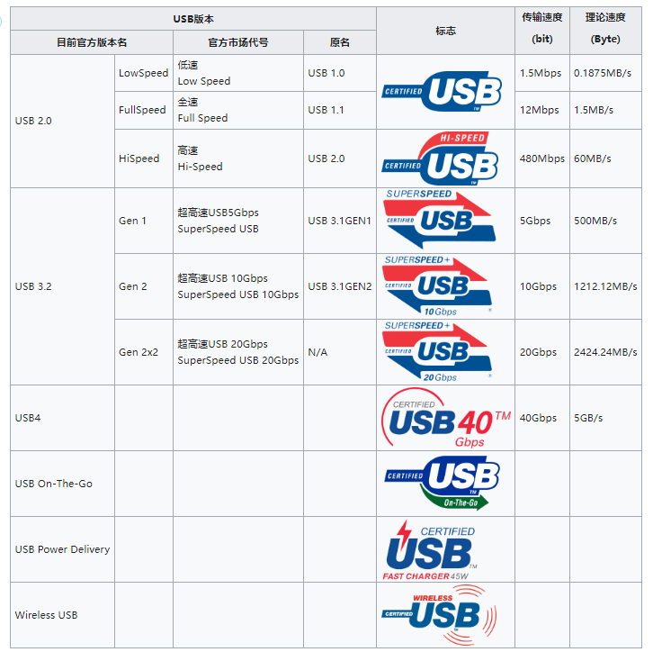

## 最新USB4

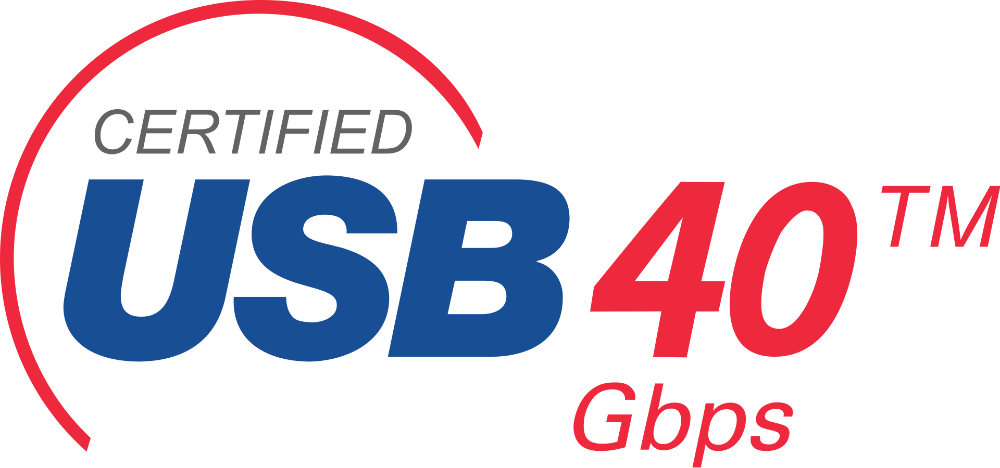

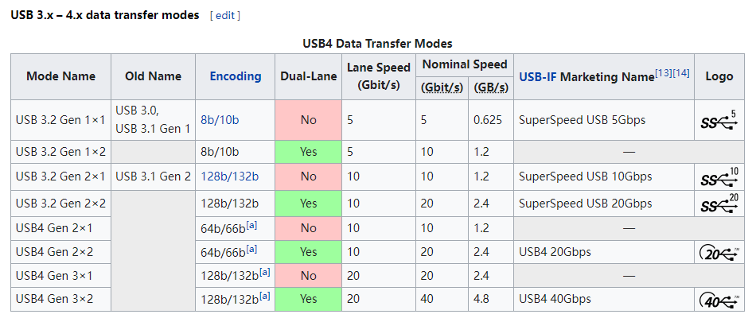

## OHCI、UHCI、EHCI、xHCI

* HCI(Host Controller Interface) 控制器

```
OHCI、UHCI都是USB1.1的接口标准，而EHCI是对应USB2.0的接口标准，最新的xHCI是USB3.0的接口标准。
1. OHCI（Open Host Controller Interface）是支持USB1.1的标准，但它不仅仅是针对USB， 还支持其他的一些接口，比如它还支持Apple的火线（Firewire，IEEE 1394）接口。与UHCI相比，OHCI的硬件复杂，硬件做的事情更多，所以实现对应的软件驱动的任务，就相对较简单。主要用于非x86的USB，如扩展卡、嵌入式开发板的USB主控。
2. UHCI（Universal Host Controller Interface），是Intel主导的对USB1.0、1.1的接口标准，与OHCI不兼容。 UHCI的软件驱动的任务重，需要做得比较复杂，但可以使用较便宜、较简单的硬件的USB控制器。Intel和VIA使用UHCI，而其余的硬件提供商使用OHCI。
3. EHCI（Enhanced Host Controller Interface），是Intel主导的USB2.0的接口标准。 EHCI仅提供USB2.0的高速功能，而依靠UHCI或OHCI来提供对全速（full-speed）或低速（low-speed）设备的支持。
4. xHCI（eXtensible Host Controller Interface），是最新最火的USB3.0的接口标准，它在速度、节能、虚拟化等方面都比前面3中有了较大的提高。 xHCI支持所有种类速度的USB设备（USB 3.0 SuperSpeed, USB 2.0 Low-, Full-, and High-speed, USB 1.1 Low- and Full-speed）。xHCI的目的是为了替换前面3中（UHCI/OHCI/EHCI）。
```


```
00:14.0 USB controller [0c03]: Intel Corporation C610/X99 series chipset USB xHCI Host Controller [8086:8d31] (rev 05)
```

用VMware测试，分别切换到USB 1.1/2.0/3.1

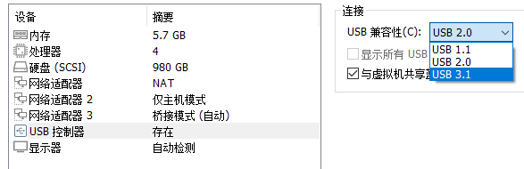

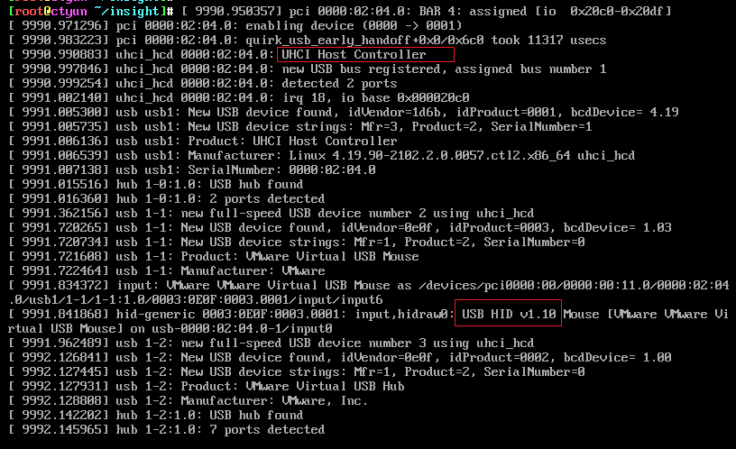

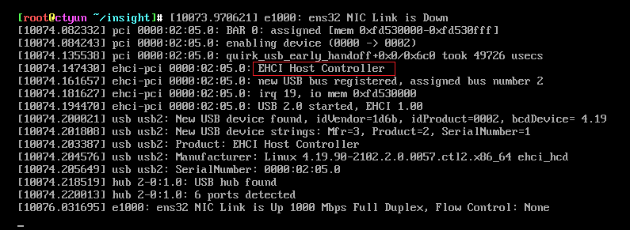

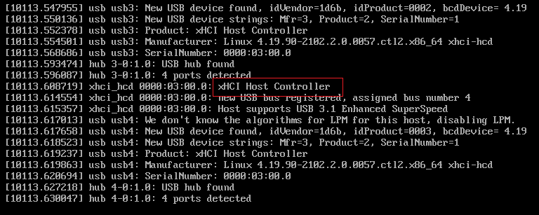

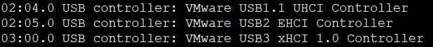

## uhci-hcd 什么意思？

* UHCI全名Universal Host Controller Interface,它是一种USB主机控制器的接口规范,江湖中把遵守它的硬件称为UHCI主机控制器
* 在Linux中,把这种硬件叫做HC,或者说Host Controller,而把与它对应的软件叫做HCD.即HC Driver.Linux中这个HCD所对应的模块叫做uhci-hcd.

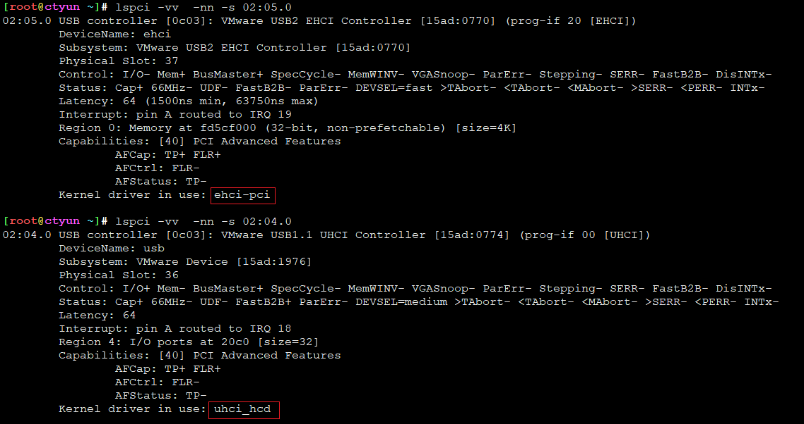

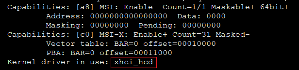


---
